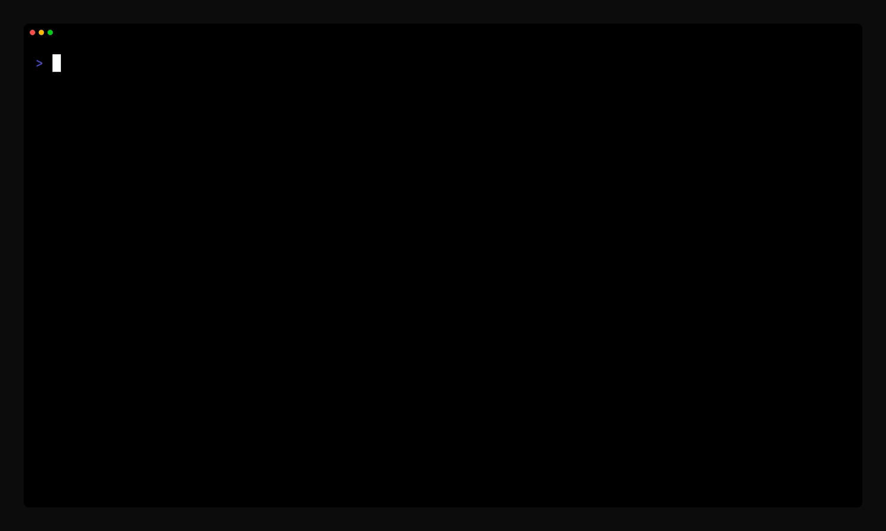

# pik



Minimal interactive line picker for the command line.

[](https://github.com/programmersd21/pik/actions)
[](https://github.com/programmersd21/pik/stargazers)
[](LICENSE)
[](https://www.rust-lang.org/)
[](https://aur.archlinux.org/packages/pik-bin)

Read newline-separated choices from stdin or a file and select one interactively.

## Install

```bash
cargo install --path .
```

## Usage

```bash
pik --file list.txt --prompt "Select:"
cat list.txt | pik
git branch | pik | xargs git checkout
```

## Options

| Flag | Description |
|------|-------------|
| `-p, --prompt <text>` | Header text |
| `-f, --file <path>` | Read from file |
| `-V, --version` | Show version |
| `-h, --help` | Show help |

## Keybindings

| Key | Action |
|-----|--------|
| `↑` / `k` | Move up |
| `↓` / `j` | Move down |
| `Home` / `g` | Jump to first |
| `End` / `G` | Jump to last |
| `PageUp` / `Ctrl+u` | Page up |
| `PageDown` / `Ctrl+d` | Page down |
| `Enter` | Confirm |
| `Esc` / `q` / `Ctrl+c` | Cancel |
| `Click` | Move cursor |
| `Double-click` | Confirm |

## Mouse

Mouse capture is enabled automatically.

- Click a row to move the cursor to it, press `Enter` to confirm, same as keyboard navigation.
- Scroll wheel moves the cursor up or down one row at a time.

## Exit codes

| Code | Meaning |
|------|---------|
| 0 | Selection made |
| 1 | Error |
| 130 | Cancelled |

## License

MIT
